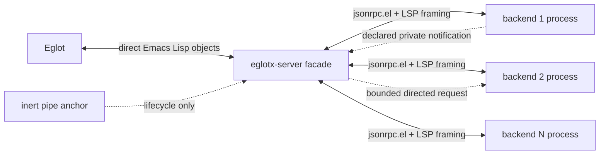
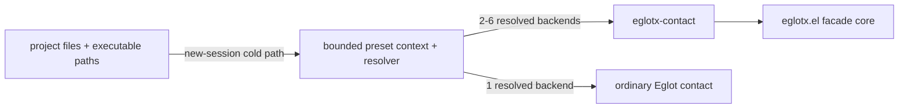

# Eglotx architecture

This document defines the implementation boundaries that keep Eglotx fast,
deterministic, and compatible with Eglot. `docs/spec.md` is the behavioral
contract; this document explains how the implementation satisfies it. Public
arguments and customization live in [`api.md`](api.md), and the documentation
authority map is [`README.md`](README.md).

## Process topology

`eglotx-server` inherits from `eglot-lsp-server`, so Eglot sees a normal native
server object. Eglot expects that object to have a process; Eglotx satisfies
that lifecycle requirement with an inert pipe anchor. The anchor carries no
LSP bytes and is closed when the facade shuts down.

The facade overrides the JSON-RPC send and shutdown boundary. Sending from
Eglot therefore enters the router as an already-decoded Lisp method and
payload. Each actual backend is a separate `jsonrpc-process-connection` and is
the only place JSON serialization and `Content-Length` framing occur. There is
no loopback socket, subprocess, or encode/decode cycle between Eglot and the
facade.

## Preset boundary

`eglotx-presets.el` and its bounded discovery engine are an optional policy
layer above the facade:

Dependency direction is one-way: presets require the core, while the core
never requires presets. The resolver uses only the public `eglotx-contact`
seam. Language names, package manifests, `node_modules`, server settings, and
mutation of `eglot-server-programs` are forbidden from the core.

The global preset mode owns exact `eglot-server-programs` entries for Svelte,
Astro, Vue, one Angular-aware JS/TS cohort, HTML, CSS/SCSS/Less, JSON/JSONC,
GraphQL, Python, the complete Go source/module/workspace cohort, and Ruby.
Eglot invokes
only the selected contact when choosing a server for a new project session. Its
contact-lifetime context walks at most 32 nearest ancestors plus a retained
project root, caps individual and aggregate metadata reads, caches positive
and negative probes, and retains at most 64 keyword-bearing candidates from
one non-recursive local listing. Remote roots skip marker listings to avoid
TRAMP's full-directory transfer. The resolver returns absolute argv and never
enters a JSON-RPC callback or protocol hot path. The resolved contact is stable
for the session; an explicit shutdown followed by a new start reruns discovery
after dependencies change.

Svelte, Astro, and Vue share one presets-layer embedded-Web add-on resolver for
Biome, ESLint, Tailwind, and GraphQL intent, executable, language, and method
policy.  Their structural primaries remain different: Svelte Language Server
and Astro Language Server each embed their HTML/CSS/JS/TS services and need no
sibling structural server, while Vue's upstream protocol requires the separate
VLS/TLS adapter described below.  Astro discovery also validates the nearest
project TypeScript SDK before constructing its contact.  No Svelte or Astro
package name, command, or capability rule enters the facade core.

The one-backend materializer normally copies the backend argv directly into an
ordinary Eglot contact.  If a descriptor has static initialization options, it
also maps them to Eglot's `:initializationOptions` contact keyword; Astro uses
this path to retain `typescript.tsdk` without paying facade overhead.  A
function-valued transformation remains a facade-only descriptor feature and is
rejected on the one-backend path rather than being invoked with Eglot's
different contact-function contract.

Mode installation snapshots the contacts that precede the bundled entries. If
a recipe cannot resolve its supported required primary or required config, it
delegates to the matching saved static contact or calls the saved functional
contact with its supported one- or two-argument arity. Thus enabling the broad
catalog does not turn an existing usable mapping into a missing-server error.
Uninstall removes only identity-owned entries and clears the fallback snapshot
and resolver without deleting equal user entries.

## Construction and lifecycle

`eglotx-contact` checks that at least two descriptors were supplied, copies
them, and returns an Eglot-native `(eglotx-server ...)` contact. Full descriptor
validation and `:when` activation occur when Eglot constructs that server.
Construction preserves each backend's declaration ordinal, then computes one
stable effective order: descending priority with declaration ordinal as the
tie-breaker. Both values are permanent for the facade lifetime.

Backend commands are argv lists passed directly to `make-process`. Activation
predicates and per-process environments are resolved before spawning; neither
commands nor environment values are interpolated through a shell. Children
inherit the project `default-directory`; ordinary `make-process` enables file
handlers for remote execution. A descriptor can instead supply its own
zero-argument process factory. The facade does not silently replace a remote
command with a local process.

Optional `:notification-handlers` are compiled once into a per-backend method
hash. The core validates only method/function shape; server names and private
protocol meaning remain preset or manual-contact policy. Such a handler uses
the public `eglotx-backend-request` operation when it must consult one named
sibling asynchronously.

Initialization is concurrent:

1. Create every active child connection.
2. Fan out `initialize` with per-backend options and a common UTF-16 position
   encoding.
3. Record results by effective backend rank, not callback order.
4. Fail startup if a required backend fails; retain and report failures of
   optional backends.
5. Combine capabilities only after the initialization cohort reaches a
   terminal state and return that facade result to Eglot. Eglot's later
   `initialized` notification is broadcast to successful children. Backend
   settings are applied only while proxying configuration requests and
   notifications.

Graceful shutdown fans out `shutdown`, followed by `exit`, to every live child.
Forced shutdown terminates remaining child processes, cancels owned timers and
continuations, and closes the anchor. Shutdown is idempotent. A required child
that exits unexpectedly closes the facade and every sibling. An optional child
can be removed from the running cohort after its registrations, diagnostics,
progress mappings, ownership, and pending legs are withdrawn.
Startup and shutdown cleanup are unwind-protected transactions: an error,
`quit`, or other non-local exit cannot strand an already started child or a
hidden JSON-RPC transport buffer.

## Routing model

Method policies are indexed once in a hash table. Target selection combines
those policies with negotiated capabilities, `:only` filters, optional
`:languages` restrictions, and liveness while
traversing the small configured backend list.
Capability values, backend language membership, and namespace ownership are
direct lookups; no claim is made that every routing decision is precomputed.

Notifications use one of five policies:

- lifecycle notifications go to every live backend;
- document notifications go to the backends that own the document and are
  adapted to each negotiated synchronization kind;
- watched-file notifications go only to backends with matching live dynamic
  registrations;
- capability-specific notifications go only to capable, allowed backends; and
- an explicitly declared backend notification handler may consume one private
  method on the same deferred FIFO used for ordered notifications.

Requests use one of five policies:

- **aggregate**: run all capable backends concurrently and merge by descending
  priority, breaking ties by declaration order;
- **singleton**: use the first capable backend in that same effective order;
- **owned**: route to the backend encoded by a result ownership token;
- **registered**: return an unknown dynamically registered method to its owner;
- **fallback**: send any other unknown method to the highest-priority eligible
  live backend after liveness, method, and known-language filtering.

The effective order governs aggregate results, singleton providers, and the
error returned when all targeted backends fail. Callback arrival order is
never observable.

### Language-scoped backends

A backend may declare a public `:languages` list of accepted LSP language IDs;
nil accepts the facade's whole cohort. Eglotx records the language ID from
`didOpen` and filters document requests and notifications before they reach a
restricted child. Diagnostics for an open document are accepted only from a
backend that accepts that document's language; diagnostics for an unopened URI
remain eligible because the facade cannot infer its language safely.

Eglot 1.24 records every mode/language pair directly. Eglotx copies that frozen
cohort once and preserves Eglot's `didOpen` language ID when routing.

Initialize-time text-document selectors, including `monikerProvider`, are
intersected with the backend restriction. Both child selector size and the
expanded intersection are limited by `eglotx-document-selector-limit`. Their
projected union is advertised only if the contributing
providers collectively cover every language managed by the facade; a scheme-
or pattern-only selector cannot claim facade-wide coverage because Eglot does
not enforce it before issuing a request. Semantic-token state cannot be split
that way, so one selected
provider must cover the complete cohort. These rules let Angular participate
only in `typescript`, Biome only in `css` within the CSS/SCSS/Less cohort, and
GolangCI only in `go` within the Go source/module/workspace cohort without
creating separate Eglot sessions.

## Request state machine

Every facade request owns one aggregation record containing its method, stable
target list, backend-keyed pending/result tables, child request identifiers,
progress mappings, an optional deadline timer, and terminal flags. When every
target is bounded, the facade deadline is the largest target timeout and begins
before fan-out; one unbounded target omits it. Graceful shutdown always uses a
one-second facade deadline.

Child callbacks validate ownership, remove their backend from the pending
table, and store `(success . payload)` under that backend. The last callback
and an optional deadline both enter the same idempotent finalizer. The
finalizer:

1. marks the record terminal before invoking user code;
2. cancels its timer;
3. removes child-to-parent request mappings;
4. walks the immutable target list to compute the method-specific result in
   effective backend order, without sorting callback output; and
5. releases continuations and aggregation storage.

Cancellation first marks the parent terminal, then sends `$/cancelRequest` for
every child request that has already been assigned an identifier. A child
reply checks that the parent and continuation are still live, so a late
response can neither call the continuation nor recreate discarded state.

The reverse direction is connection-scoped too. The child connection captures
the complete server-to-client request envelope before `jsonrpc.el` drops its raw
ID from the dispatcher call. Active handlers are keyed by `(connection, id)`.
A child `$/cancelRequest` synchronously marks only that record; it immediately
unwinds only the deepest matching handler, while cancellation of an outer
handler is observed at that handler's own boundary so a nested request still
receives its response. The cancelled request returns LSP
`RequestCancelled (-32800)` and no raw child ID crosses the facade.

Partial-result tokens are omitted for every child: forwarding an unmerged
partial value would make callback timing observable and bypass ownership and
command decoration even with one provider. For a single-target request,
work-done tokens are mapped to opaque child tokens and released with the
request. Fan-out requests omit work-done tokens because multiple lifecycles
cannot safely share one client token. Cancellation, timeout, or child failure
synthesizes an `end` for any progress lifecycle that actually began; a late
child `end` is then ignored rather than creating a new facade token.

If any backend succeeds, failed siblings do not discard successful results.
If all fail, the highest-priority error wins. A single-target request uses the
same finalizer and observable error contract without waiting for unrelated
backends.

### Explicit backend adapters

A notification handler can issue a directed request to one named sibling. The
backend name index makes target lookup constant-time; normal capability
fan-out and unknown-method routing are bypassed only for that explicit adapter.
These records are separate from facade request aggregation and are capped by
`eglotx-cross-backend-request-limit`.

Each record fixes its source, target, child request ID, success/error
continuations, and deadline. JSON-RPC callbacks enter one idempotent finalizer,
which releases ownership before enqueueing adapter code outside the process
filter. Success, error,
timeout, target exit, source exit, and facade shutdown all release the same
record. Timeout and source exit also send `$/cancelRequest` when a target child
ID exists. A target failure calls the adapter's error continuation only while
its source remains live; a source failure discards the response path entirely.

The Vue preset is the first consumer: it translates VLS
`tsserver/request` into TypeScript Language Server's
`typescript.tsserverRequest` execute-command and returns `tsserver/response`.
No Vue method, package name, or payload transform exists in the core.

### Backend-to-Eglot path

The reverse direction is not a blind relay. The child connection remains the
source identity while Eglotx applies one bounded policy before calling Eglot's
ordinary dispatcher:

- `workspace/configuration` replies are detached or path-copied and receive the
  requesting backend's settings overlay;
- work-done creation/progress and cancellation use a backend namespace, while
  child partial-result tokens never reach the facade client;
- register/unregister requests update owned watched-file state, and only the
  selected semantic-token provider can enqueue an upstream refresh;
- standard `publishDiagnostics` enters the source-snapshot hub;
- log/show messages may receive the backend prefix controlled by
  `eglotx-prefix-server-messages`;
- an explicitly configured notification handler runs later on the facade FIFO
  and may consume its method; and
- remaining supported requests and notifications use Eglot's upstream handlers
  with their original LSP shape.

The private Eglot streaming-diagnostics capability is removed from every child
initialize request, and unsolicited child `$/streamDiagnostics` notifications
are consumed rather than forwarded.

## Method-specific combination

A generic recursive merge is intentionally forbidden. LSP result shapes use
different identities and absence semantics, so each supported method family
has an explicit policy.

| Family | Combination rule |
| --- | --- |
| locations | Normalize `LocationLink` to `Location`, then stably combine by URI and range identity. |
| highlights, lenses, links, colors, folding ranges, inlay hints, inline values, monikers, code actions, hierarchy-prepare items, workspace symbols | Stable priority-then-declaration concatenation; exact duplicate JSON values keep only the highest-priority owner. |
| hierarchy follow-ups and standard resolve methods | Route through the opaque owner retained on the originating item; collection-shaped hierarchy replies remain exactly de-duplicated. |
| document symbols | Highest-priority capable provider, preserving its internally consistent `DocumentSymbol[]` or `SymbolInformation[]` shape. |
| completion | Negotiate only compactly supported `data`/`editRange` defaults, materialize required compatibility fields during one preallocated-vector pass, OR `isIncomplete`, preserve every item without cross-backend de-duplication, and attach one atomic response ownership batch. |
| inline completion | Use the highest-priority capable provider, preserve either legal result shape, and namespace every item command. |
| hover | Normalize contents and join non-empty contributions as Markdown in effective backend order. |
| formatting variants, rename/prepare, signature help, selection ranges, linked editing, will-save edits | Highest-priority eligible capable provider. |
| semantic tokens | One highest-priority capable provider for the document lifecycle. |
| diagnostics | Backend snapshots, optionally projected under stable Eglot streaming tokens; child provider identifiers and `resultId` values remain per leg. |
| execute command and static workspace file operations | Route to the backend selected when the opaque command or advertised operation filters were created. |
| unknown request | Registration owner when dynamically registered; otherwise the highest-priority eligible live backend. |

For completion and signature help, target selection also checks a request's
trigger character against each child's advertised trigger set. Capability
union therefore does not cause a child to receive triggers it did not declare.

Capability combination follows the same principle. Routable boolean providers
use logical union, trigger-character and command arrays use stable union, and
singleton capabilities are copied from the highest-priority capable backend.
An unknown capability is copied only from the actual primary live backend when
it covers the whole cohort. This is deliberately stricter than unknown-method
routing: if that primary did not advertise the capability, Eglot is not invited
to call a secondary-only extension even though a manually issued unknown
request can still choose the highest-priority eligible backend.
For document capabilities, the contributing providers must cover the facade's
complete language cohort; semantic tokens require one full-cohort provider.
`textDocumentSync` is advertised once by the facade; incremental changes are
converted to full snapshots only for children that require them. Nested
workspace capabilities are handled per method: workspace-folder support is
unioned, while each client-supported file operation copies one provider's
filters and is pinned to that same provider without failover. Semantic-token,
notebook-sync, and file-operation pins are sticky: losing the selected backend
withdraws the advertised capability instead of silently selecting sibling
state whose legend, lifecycle, or filters were never exposed.

## Ownership and namespace isolation

Backend request IDs are private to each `jsonrpc-process-connection`. The
facade keeps an explicit parent-to-child map rather than deriving one numeric
ID from another.

The core classifies connection-scoped LSP state by semantics rather than by
method name:

| State kind | Facade representation | Retirement rule |
| --- | --- | --- |
| Replaceable snapshot | `(backend, canonical-document, modality) -> value` | Remove only the retiring backend's slot, then project surviving slots. |
| Completion response | One batch plus contiguous backend segments, shared defaults, and optional override vectors | Fallback eviction drops only table lookup; live candidate leases retain the batch. Backend failure invalidates its segments without scanning items. |
| Opaque follow-up value or command | Facade token -> backend, exact child value, and one retention container | O(1) unlink on request/document/backend retirement; bounded document/orphan caches evict exactly one oldest owner. |
| Incremental cursor | Facade cursor -> per-backend child cursors plus document generation | Unknown, evicted, foreign, or reopened-document cursors degrade to full. |
| Watched-file registration | Per-backend child ID -> normalized watchers | Remove the retiring backend's entries, then reconcile the stable physical union. |
| Progress identity | Per-backend namespace with transactional reverse map | End and withdraw only identities owned by the retiring backend. |
| Semantic refresh invalidation | One facade pending bit plus one FIFO job | Clear after upstream dispatch or facade shutdown; duplicate requests retain no extra state. |

This mirrors the useful part of lsp-mode's multi-workspace design: each
`lsp--workspace` retains its own diagnostic table and the UI layer aggregates
across workspaces, so one server never replaces another server's source state.
See lsp-mode's
[workspace-owned diagnostics](https://github.com/emacs-lsp/lsp-mode/blob/6bfc593d7b1bc0dd656f09ffce52cc085ebced05/lsp-mode.el#L2403-L2505)
and
[Flymake aggregation](https://github.com/emacs-lsp/lsp-mode/blob/6bfc593d7b1bc0dd656f09ffce52cc085ebced05/lsp-diagnostics.el#L319-L340).
Eglotx cannot rely on separate client workspaces because it presents one
facade connection, so that connection identity is restored explicitly as the
backend dimension in these ledgers.

Objects that return through a later request carry a small facade ownership
token. The token indexes the backend and original opaque value; Eglotx copies
only the object path that must be decorated and never mutates a child-owned or
Eglot-owned JSON object. Resolve restores the original value and targets only
its owner.

The same per-backend namespace discipline applies to:

- command identifiers and `workspace/executeCommand` (every exposed command,
  including inline-completion and code-action documentation commands and a
  globally unique raw command, is replaced by an opaque facade-session
  identifier);
- work-done progress tokens (partial-result tokens are deliberately removed
  until chunks can pass through the normal merge and ownership pipeline); and
- diagnostic `data` and streaming diagnostic tokens.

Initialize-time static registration IDs are child-connection identities, not
facade identities. They are stripped from aggregate provider options instead of
being reimplemented by the facade. This is intentionally different from a
diagnostic provider `identifier`, which is an incremental cursor namespace and
must be virtualized. Workspace-folder `changeNotifications` string IDs are
normalized to boolean support.

Mappings have an explicit owner (request, document, diagnostic snapshot,
registration, or server lifetime) and are released with that owner.
Completion uses a compact response record: one segment per backend, one shared
default data value plus a lazily allocated override vector per segment, and
opaque segment/index handles. Items inheriting the same segment default reuse
one handle; only explicit per-item data needs an indexed handle. Each handle
remains a valid JSON string, but on the direct Eglot/facade Lisp boundary it
also carries a private lease to its compact batch. The lease follows the
candidate object's reachability; after the final lease disappears, a later
Emacs GC can reclaim the cycle. It adds only O(backends) state for Tailwind's
shared-default path. The newest
`eglotx-completion-batch-limit` responses are also retained per document (and
for orphan results) as a bounded fallback for copied strings that lose Lisp
properties. Eviction and document mutation remove that lookup entry without
invalidating a still-live Eglot candidate. Completion items may be resolved
after a document generation changes, as required by Eglot's cached CAPF
session; a mutation while completion or resolve is in flight still yields
`ContentModified`. For an open managed document, a leased handle is admitted
only for its facade session, the identical document record, and a running
backend. Thus `didChange` keeps a menu usable, while close/reopen ABA and
backend retirement invalidate it even after its batch left the fallback cache.
Orphan batches have no document incarnation and retain only the session,
backend-liveness, and bounded-fallback guarantees; normal Eglot CAPF candidates
come from open managed documents. Resolve
updates its data slot in place. Ordinary non-diagnostic records for an open
document use a newest-first intrusive cache capped by
`eglotx-document-owner-limit`. Values from unopened files and
workspace-wide results use a second intrusive cache capped by
`eglotx-orphan-owner-limit`. Each owner records its unique container node, so
resolve-time migration, refresh, arbitrary removal, and oldest eviction are all
O(1); there are no tombstones, compaction scans, or duplicate membership across
orphan and document caches. Diagnostic owners use the same exact container
model without a per-document count cap because their lifetime is already
bounded by replaceable source snapshots. Stable command mappings intentionally
last for the facade session and have a separate per-backend index for exact
failure retirement.

## Dynamic watched files

Eglot advertises dynamic registration only for
`workspace/didChangeWatchedFiles`; Eglotx therefore rejects every other dynamic
registration rather than duplicating a capability system the client cannot
consume. Watched-file registrations contribute their watcher patterns to a
stable union visible to Eglot. Eglotx retains the owners behind that union: each
`workspace/didChangeWatchedFiles` change is matched against live registrations
and sent only to the corresponding backends. Removing one registration, or
cleaning up an optional backend, rebuilds the union without withdrawing another
backend's equal watcher pattern. Registration arrays and the total logical
pattern set are bounded by `eglotx-file-watcher-limit`; reconciliation dedupes
physical patterns in a hash, acknowledges the child, then calls Eglot from the
facade FIFO so project enumeration never runs in the child callback. The
reconciliation is a coalesced owned projection: Eglot failures retry with
bounded exponential backoff, and a newer logical state cancels that delay and
reconciles immediately. Physical watchers are reduced to their defined LSP
fields, deduplicated, and stably sorted so hash iteration cannot cause churn.

Workspace file-operation events do not include a registration identifier.
Static operations are therefore deterministic singletons whose advertised
filters and routed backend are selected together. Dynamic file-operation
registration is rejected explicitly; Eglot 1.24 does not advertise
that feature, and accepting it would make overlapping child filters ambiguous.

Eglot advertises and handles semantic-token refresh. Eglotx acknowledges a
selected provider's `workspace/semanticTokens/refresh` immediately and queues
the upstream handler on the facade FIFO, outside the child JSON-RPC callback.
A pending bit collapses repeated requests until that handler returns. The same
request from an inactive sibling is acknowledged and dropped. Other refresh
methods are not recognized or coalesced by the facade.

## Diagnostics

Diagnostics are the first consumer of the source-snapshot hub. Their sole fact
store is keyed by backend, canonical document identity, and source modality
(push or pull);
the open-document record does not keep a duplicate diagnostic map.
Open-document snapshots additionally carry their document generation.
Snapshot index replacement is O(1), excluding the necessary linear pass over
the diagnostic payload; an empty publication removes only that backend's
snapshot for the same modality. Non-streaming push publications are queued in
the facade's O(1) work FIFO and coalesced per URI before one aggregate dispatch.
Collection and aggregate dispatch are split into
`eglotx-diagnostic-chunk-size` continuations at the queue head, preserving the
notification barrier while bounding each work item. Every such continuation
forces a new event-loop turn rather than consuming another slot in the current
deferred-work drain. A complete publication is
validated before ownership or snapshot state changes, so one malformed child
cannot erase a valid sibling or prior snapshot.
Pull `relatedDocuments` are independently snapshotted and merged. Version
presence is tested independently of truthiness, so version zero is handled
correctly. An open document accepts a versioned publication only when it
exactly equals the current version; both older and future values are dropped.
For an unopened URI, only values below the source high-water mark are stale.
Versionless publications are accepted without erasing a numeric high-water
mark.

File document identity is canonicalized before queueing, snapshot lookup,
ownership lookup, or cursor lookup. The canonicalizer normalizes scheme and
host case, percent-encoded unreserved bytes, dot segments, and Windows drive
spelling without consulting the filesystem or TRAMP. A bounded raw-to-canonical
cache keeps the hot path O(1). Non-file URIs are deliberately opaque because a
virtual-document provider owns their identity semantics.

Persistent state for unopened documents is governed by one exact, server-wide
LRU, shared by push and pull sources. Its default
bound is `eglotx-unopened-diagnostic-uri-limit` (4096); open documents are
exempt because their state is retired by the Eglot document lifecycle. The LRU
uses a hash plus an intrusive doubly linked list, so admission, touch, and
unlink are O(1). Eviction invalidates cursors and removes every backend's
snapshot, owner, version watermark, and token reference for that
canonical URI before sending one retraction if the URI was visible.
An initial empty report is not projected for an unseen unopened URI. After an
empty retraction or `didOpen`, Eglotx also removes Eglot's exact server-owned
`flymake-list-only-diagnostics` alist cell; Eglot otherwise retains a nil entry
until connection shutdown. A pull cursor is minted only if its unopened URI is
still resident when response aggregation finishes, so eviction always degrades
the next request to a full report.

When the running Eglot supports streaming diagnostics and the successfully
initialized backend cohort is entirely push-only, each backend's standard push
snapshot is projected under a stable facade-namespaced token for an open
managed document. This decision is session-sticky: retiring an optional pull
backend does not switch the surviving projection back to streaming.
That allows a child snapshot to change without rebuilding vectors from every
sibling. Unopened URIs instead receive one ordinary aggregate because Eglot's
list-only diagnostic store has no streaming-token continuation. If any backend
provides pull diagnostics, streaming is disabled for that cohort and push-only
siblings use ordinary aggregate publications; Eglot can then combine them with
its pulled report map. Older Eglot versions also receive deterministic
aggregate publications.

This extension is intentionally one-way. Eglotx removes the private streaming
capability from child initialize requests, ignores unsolicited child
`$/streamDiagnostics` notifications, and accepts standard
`textDocument/publishDiagnostics` as the child diagnostic input.

Diagnostic `data` never crosses backend boundaries. Eglot sees only a compact
ownership token; the original data is restored only when routing a related
request back to the source backend. Visible `source` is rewritten as
`backend/source`, or just `backend` when absent. Once a backend negotiated pull
diagnostics, its ordinary push snapshot is excluded from aggregate push output
so Eglot does not display that source twice.

Pull diagnostics use a second projection over the same source ownership.
The facade advertises one opaque provider identifier only when at least one
child provided a string identifier. It injects a child's original identifier
on that leg when present and otherwise removes the field, then signs one
bounded facade `resultId` whose record contains the child result IDs. Full and
unchanged child reports are materialized before aggregation. Document cursors
are bound to the exact open-document object and mutation generation, preventing
an old cursor from surviving change, close/reopen, or unopened-open-close ABA
transitions. A
primary mutation during an in-flight pull yields `ContentModified`; a related
document whose mutation epoch changed is omitted. Related-document cursors are
bound to canonical URI and modality. A missing record is a cache miss, not a
protocol failure: the child receives no previous result ID and computes a full
report. The unopened-document LRU is also checked at cursor mint time, after
primary and related reports have all been ingested.

## Performance invariants

- No synchronous child wait occurs in a process filter or JSON-RPC callback.
- Callbacks update request bookkeeping immediately but defer expensive final
  merges, ordered notification work, and semantic refresh through one O(1)
  FIFO.
- Deferred work drains at most `eglotx-work-batch-size` jobs per event-loop
  turn; each diagnostic job processes at most
  `eglotx-diagnostic-chunk-size` publications, owners, commands, source keys,
  client retractions, pull-buffer resets, or URI dispatches. Diagnostic and
  failure-retirement continuations explicitly yield to the next turn.
- Fan-out happens before aggregation work; child latency overlaps.
- Directed adapter requests are bounded independently from facade fan-out,
  use constant-time target lookup, and always have a finite deadline.
- Stable ordering walks the immutable target list over backend-keyed result
  tables; it never sorts callback output.
- Logging and event payload formatting are absent from backend hot paths when
  disabled.
- Payload transformation uses path copying; whole protocol objects are not
  copied by default.
- Completion aggregation stages one response batch, fills one preallocated
  vector in backend order, and copies each valid item spine once. Child
  `itemDefaults.data` remains shared behind the batch handle. The separate
  Eglot adapter advertises resolve-time `textEdit`; after that explicit
  negotiation, `itemDefaults.editRange` also remains one segment value and is
  materialized only for the selected resolve request. The materialized request
  is the in-flight fallback if its bounded batch is evicted. Command rewriting
  runs only on items that carry a command.
- Opaque owners, commands, and diagnostic source keys have exact per-backend
  intrusive indexes. Document/orphan owner retention also uses exact intrusive
  caches, so removal and migration never scan or rebuild a ring.
- Completed requests and obsolete open-document generations retain no timers
  or continuations. Open-document and orphan ownership are independently
  bounded; unopened diagnostic identities are bounded across every modality;
  and session-stable command mappings are released with the facade.
- Incremental edits do not reconstruct or retain a full document string unless
  at least one live backend requires full synchronization; all such backends
  share the same authoritative snapshot.
- Backend stderr buffers are truncated incrementally to a configurable limit.
- Status inspection reads snapshots only and never changes protocol timing.
- Preset discovery is outside all protocol paths: its filesystem work is
  limited to the ancestor chain, each manifest read and local marker result is
  capped, remote marker listings are skipped, and it starts no subprocess.

The benchmark suite measures route/target selection, UTF-16 change
application, capability combination, completion merge/ownership, diagnostic
attribution, and Tailwind's 11,509-item shared-default path. Results are useful
for comparisons on the same Emacs build and machine; CI tests correctness, not
wall-clock thresholds. The opt-in `make test-corfu-e2e` target adds a real
Tailwind → Eglot CAPF → Orderless → Corfu candidate/selection path; its
configurable latency gate is intended only for same-machine regression checks.

## Failure boundaries

Malformed messages are contained by the child `jsonrpc.el` connection. An
optional backend process exit marks that child dead, completes its request legs,
withdraws its registrations and diagnostic contribution, and leaves healthy
siblings usable. A required backend crash is a facade failure: every sibling
and the anchor are closed so Eglot never continues against a capability set
whose required member is missing. Eglotx does not automatically restart a
backend or replay workspace state.

Optional-backend cleanup is an unwind-protected state machine over exact
per-backend intrusive indexes: `owners -> commands -> source removal -> client
retraction -> pull reset -> finalize`. Each phase handles at most
`eglotx-diagnostic-chunk-size` entries and forces the next continuation into a
new event-loop turn; it never enumerates global owner or diagnostic tables.
Source removal completes before any aggregate retraction, so Eglot cannot see a
half-retired backend. Retraction and reset queue heads are committed only after
their dispatcher returns, making non-local exits retry an idempotent operation
instead of dropping it. Interrupted outward work retries with exponential
backoff from 50 ms up to 1 s and re-enters at the ordinary FIFO tail. This
rate-limits persistent dispatcher failures and lets unrelated facade jobs make
progress; any successful retirement chunk resets the delay. A final phase
barrier re-enters owner, command, or source removal if any late internal writer
appeared.

Dynamic registration and progress-create forwarding are transactional across
all non-local exits. Diagnostic payloads receive an additional semantic check
before snapshot mutation because structurally valid JSON can still violate the
LSP array/object shape expected by the facade.

The implementation is single-threaded in the normal Emacs event loop, but all
terminal transitions are still written as idempotent state changes. This is
necessary because cancellation, timeout, sentinel failure, and a reply can be
queued adjacent to one another.
